# 音樂與心理相關影響分析

### 資料來源

https://www.kaggle.com/datasets/catherinerasgaitis/mxmh-survey-results  

## 音樂效果

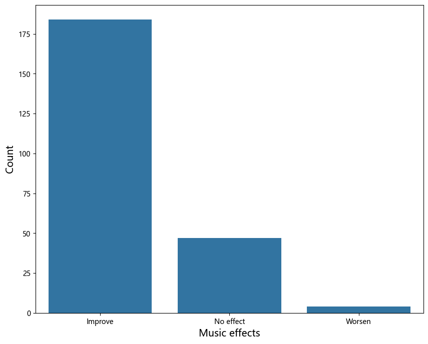
**可以發現大部分的音樂都有顯著的正面效果**  

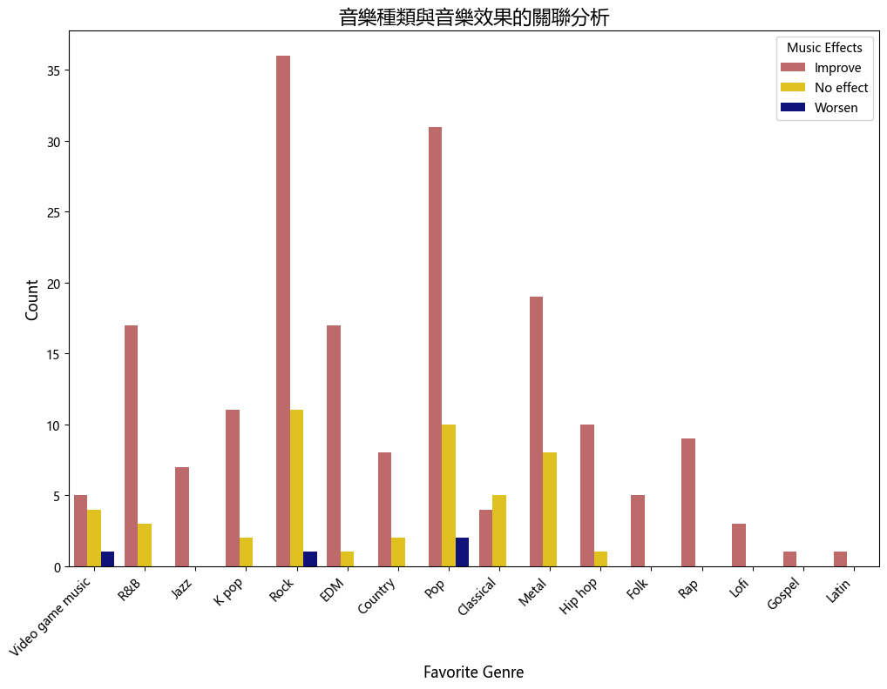
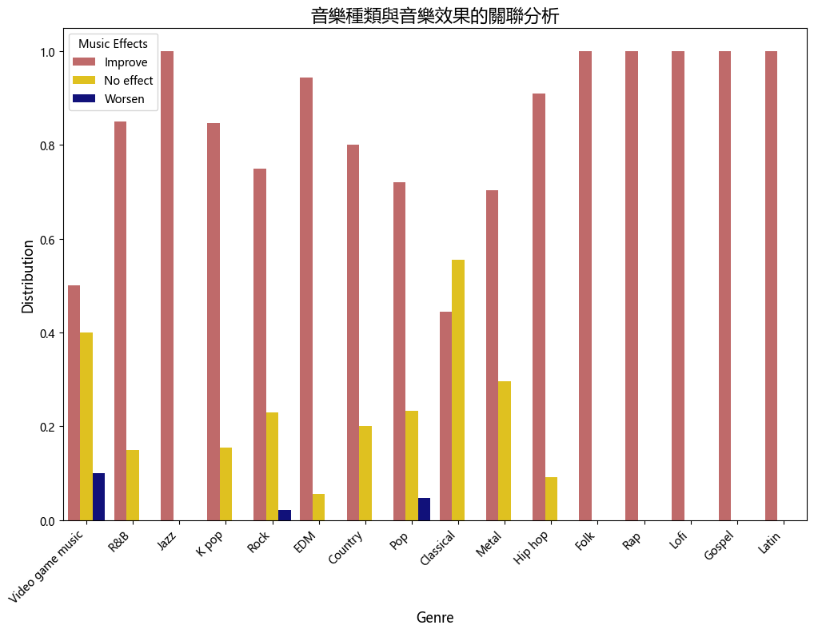
**大部分音樂有正面效果**  
推測:  
大多數其他音樂類型（除Video Game、Pop和Rock外）呈現正面效果，顯示這些音樂成功地提升了聽眾的情緒或滿足了他們的需求。  
  
**Classical 和 Video Game Music 有較大比例沒有效果**  
推測:  
Classical Music：可能因其穩定和中性的特質，在某些應用場景中無法引起強烈的情感反應。  
Video Game Music：可能在某些場景下未能有效地增強遊戲氛圍或情感。
  
**Video Game Music、Pop 和 Rock 有少數負面效果:**  
推測:  
Video Game Music：可能因為某些遊戲場景（例如：失敗或困難的挑戰）故意設計使用負面效果的音樂來強化玩家的情感反應。  
Pop 和 Rock：這些負面效果可能來自一些具有強烈情感的歌曲（例如：抒情搖滾歌曲可能涉及悲傷主題）  

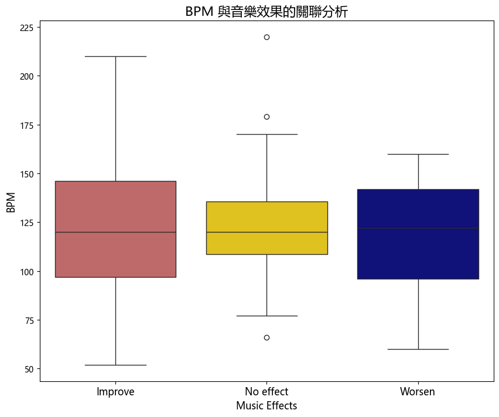
**Improve音樂效果類別：**  
這個音樂效果類別的 BPM 數據集中在較低的範圍內，並且具有相對較小的 IQR（49）。  
這表明當音樂效果被描述為改善時，通常對應著 BPM 在較高範圍內的變化，且變化幅度可能相對較大。  

**No effect音樂效果類別：**  
這個音樂效果類別的 BPM 數據集中在中等範圍內，但其 IQR（27）相對較小。  
這可能表明雖然該音樂效果類別被描述為無效，但 BPM 的變化幅度相對較小，可能在整體上對 BPM 沒有明顯的影響。  

**Worsen音樂效果類別：**  
這個音樂效果類別的 BPM 數據集中在較高的範圍內，並且具有相對較大的 IQR（46）。  
這表明當音樂效果被描述為惡化時，通常對應著 BPM 在較低範圍內的變化，且變化幅度相對一致。  

**發現這三種沒有差很多**  

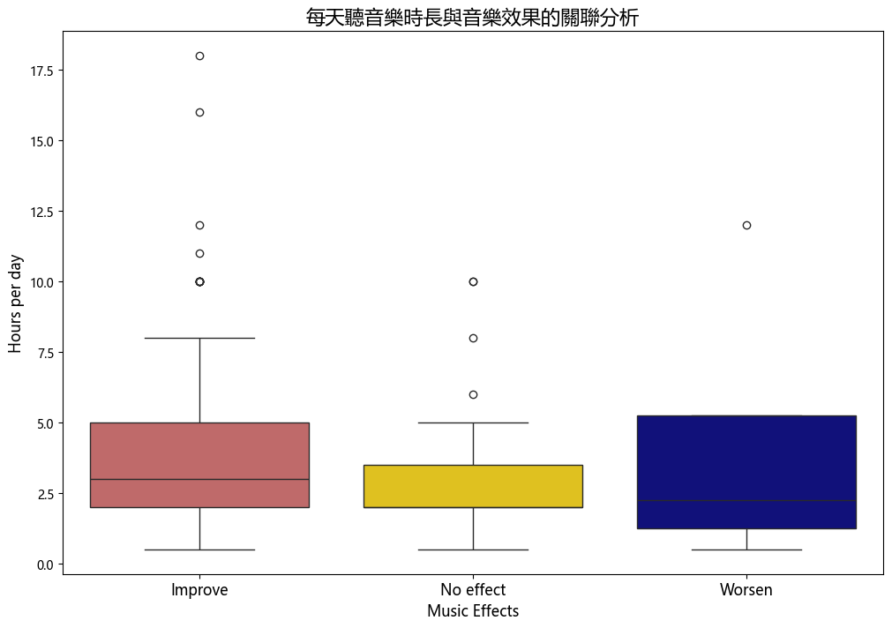
**Improve音樂效果類別：**  
中位數為3.00小時，IQR為3.00小時  
**No effect音樂效果類別：**  
中位數為2.00小時，IQR為1.50小時  
**Worsen音樂效果效果類別：**  
中位數為2.25小時，IQR為4.00小時  

**無法得出結論**

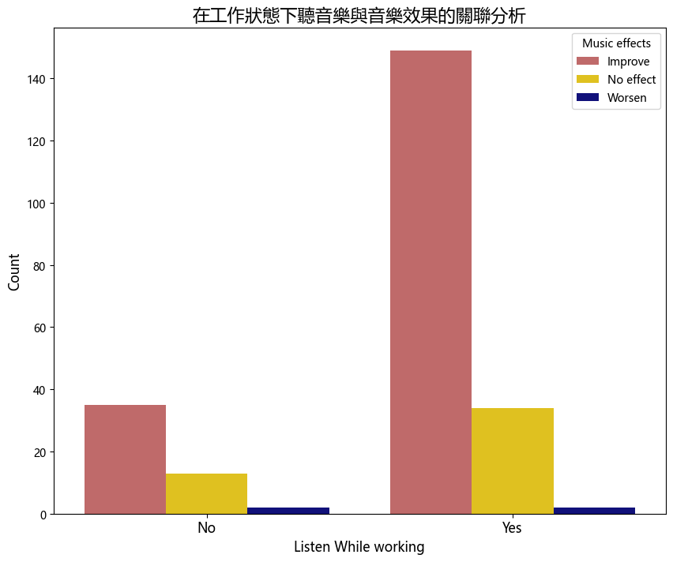
**P-value (0.159) 大於常用的顯著性水平（如 0.05 或 0.01），因此我們無法拒絕原假設。這意味著我們沒有足夠的證據表明在工作狀態下聽音樂與音樂效果之間存在顯著關聯。**

**Chi-squared 值 (3.67) 並不是非常高，這也表明觀察到的數據與期望數據之間的差異並不大。**  

## 失調or疾病
Anxiety（焦慮）  
Depression（抑鬱）  
Insomnia（失眠）  
OCD（強迫症） 

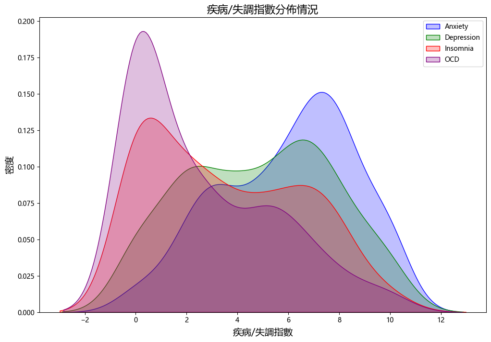
-----------------

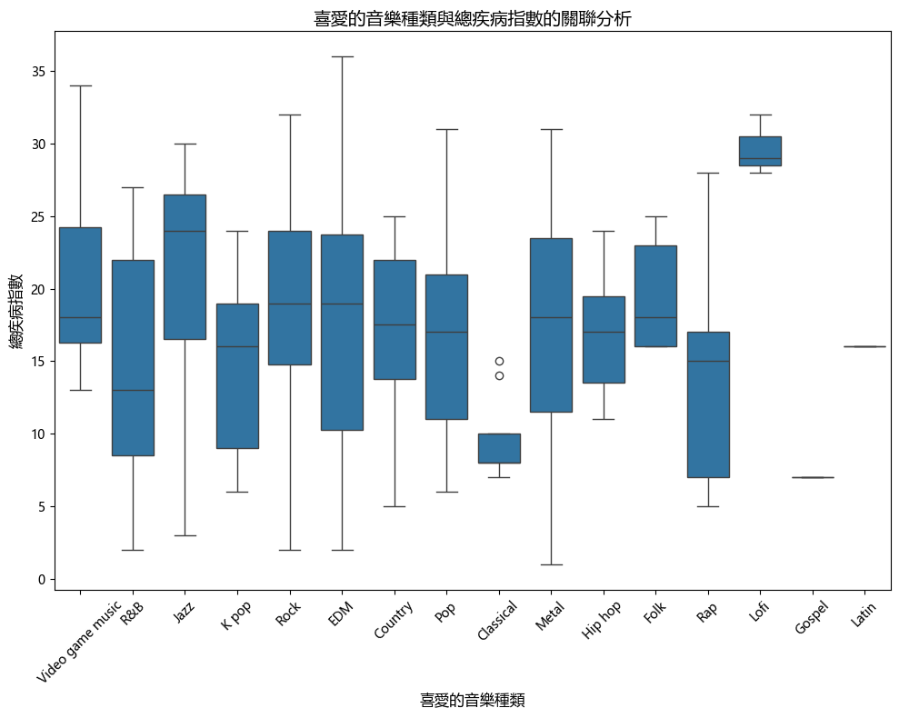
低指數：Classical、Gospel 這兩類音樂喜好者的總疾病指數相對較低  
中等指數：Hip hop、K pop、Pop、R&B、Rap 等音樂喜好者的總疾病指數在中等範圍  
高指數：Lofi、Jazz、Video game music、Rock、Folk 等音樂喜好者的總疾病指數較高  

**從中可以看出，某些音樂類型的喜好者可能與較高的總疾病指數有關聯。**

***ANOVA分析***  

焦慮症（Anxiety）：p值小於0.05，音樂類型對焦慮症狀有顯著影響  
抑鬱症（Depression）：p值小於0.05，音樂類型對抑鬱症狀有顯著影響  
失眠（Insomnia）：p值小於0.05，音樂類型對失眠症狀有顯著影響  
強迫症（OCD）：p值大於0.05，音樂類型對強迫症狀沒有顯著影響  

**這表明，不同音樂類型對焦慮、抑鬱和失眠有顯著影響，而對強迫症的影響不顯著。**  

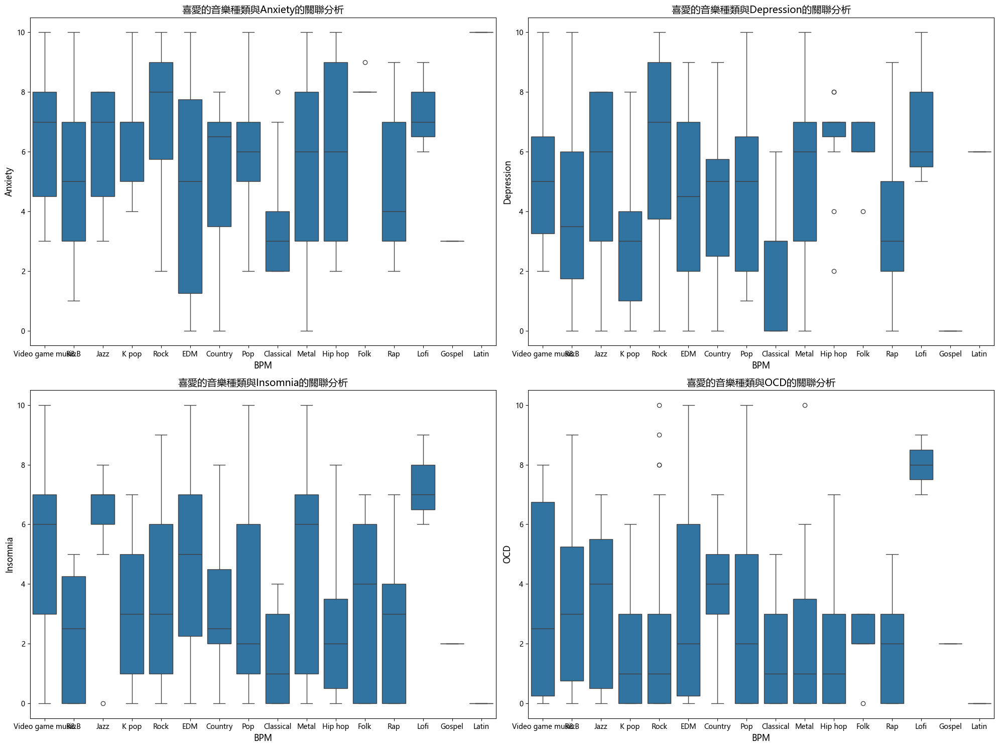
**可以看出喜歡聽某些音樂的人有較高的疾病指數**

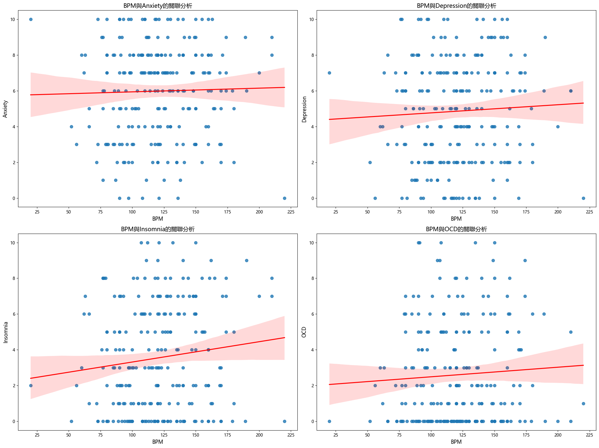
**這些相關係數都接近於 0，表示 BPM 與這些疾病指數之間的線性關係較弱。因此，根據結果，我們無法得出顯著的結論表明 BPM 與這些特定疾病嚴重程度之間存在明顯的相關性。**

***ANOVA分析***

焦慮症（Anxiety）：p值大於0.05，BPM對焦慮症狀沒有顯著影響  
抑鬱症（Depression）：p值大於0.05，BPM對抑鬱症狀沒有顯著影響  
失眠（Insomnia）：p值略大於0.05，BPM對失眠症狀沒有顯著影響，但接近顯著  
強迫症（OCD）：p值大於0.05，BPM對強迫症狀沒有顯著影響  

**這表明，BPM（音樂的每分鐘節拍數）對焦慮症、抑鬱症和強迫症的影響不顯著，對失眠症狀的影響接近顯著，但仍不顯著。總體來看，BPM似乎不是影響這些心理健康狀況的關鍵因素。相較之下，之前的分析顯示音樂類型對某些心理健康狀況（如焦慮症、抑鬱症和失眠）有顯著影響。這可能意味著音樂的種類比其速度對心理健康有更重要的影響。**

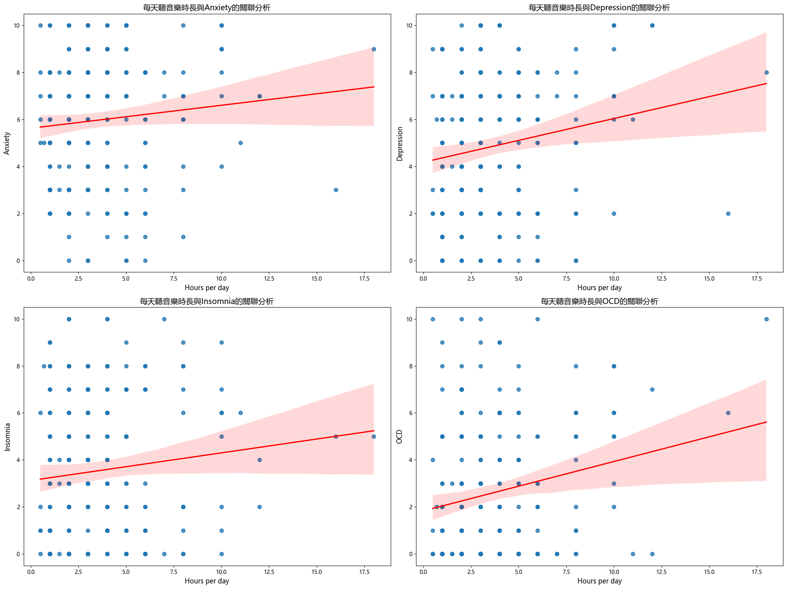
**這些相關係數都接近於 0，表示音樂時數與這些疾病指數之間的線性關係較弱。根據結果，我們無法得出顯著的結論表明音樂時數與這些特定疾病之間存在明顯的相關性。**

***ANOVA分析***

焦慮症（Anxiety）：p值大於0.05，每天聽音樂的時數對焦慮症狀沒有顯著影響  
抑鬱症（Depression）：p值小於0.05，每天聽音樂的時數對抑鬱症狀有顯著影響  
失眠（Insomnia）：p值大於0.05，每天聽音樂的時數對失眠症狀沒有顯著影響  
強迫症（OCD）：p值小於0.05，每天聽音樂的時數對強迫症狀有顯著影響  

**這表明每天聽音樂的時數對抑鬱症和強迫症有顯著影響，而對焦慮症和失眠的影響不顯著。這些結果可以幫助我們了解每天聽音樂的時數如何影響不同的心理健康狀況，並可能為音樂治療提供有價值的見解。這也提示我們，針對抑鬱症和強迫症，調整聽音樂的時數可能會帶來顯著的效果。**  

